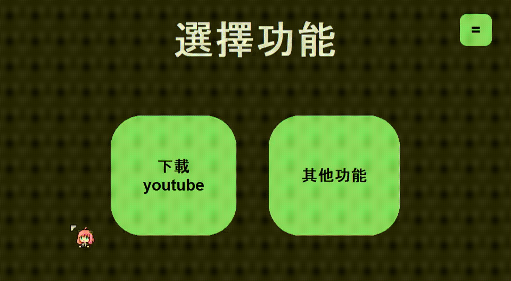
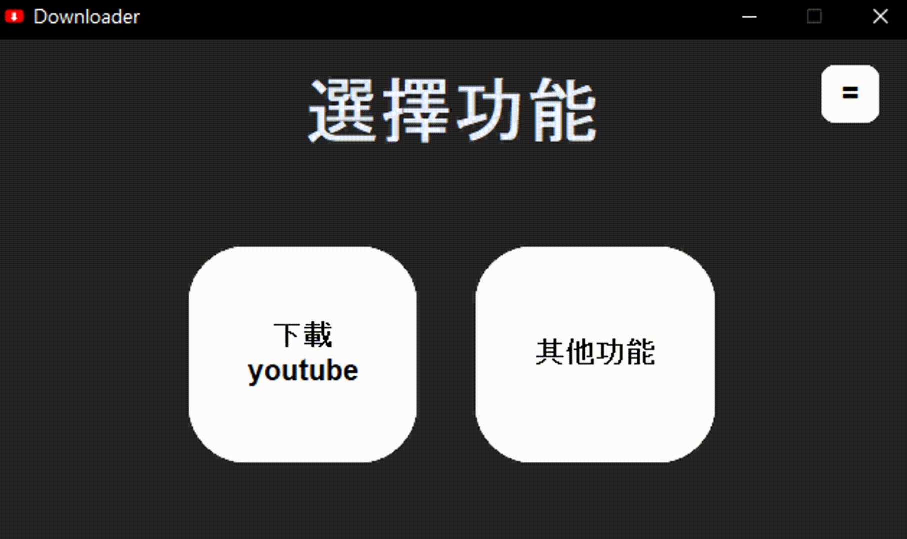

# Downloader

簡介：
> 下載yt影片。

---

## 目錄

- [功能特色](#功能特色)
- [系統需求](#系統需求)
- [安裝方式](#安裝方式)
- [使用方法](#使用方法)
- [程式碼分享](#程式碼分享)
- [開發與貢獻](#開發與貢獻)
- [授權](#授權)

---

## 功能特色

- 1：可以下載Shorts影片、單一影片、播放清單影片
- 2：介面簡單，沒有複雜的按鈕
- 3：可以更換喜歡的顏色

---
## 系統需求

- Windows 10 以上
- Python 版本：3.12以上

---

## 安裝方式

### Windows(推薦)

1. 到<https://sites.google.com/view/yt-to-dowload>或<https://github.com/SeanHsu324/Setup>下載DownloaderSetup.exe
2. 解壓縮到任意資料夾
3. 雙擊 `DownloaderSetup.exe` 開始自動下載

### Python 環境版本 (無法自動更新，需手動更換.py)

```bash
git clone https://github.com/SeanHsu324/Downloader.git
cd Downloader
pip install -r requirements.txt
```
### 建立空白的cookie.txt(和main.py放在同一個資料夾)

在專案目錄下執行以下指令即可建立一個空白檔案：

```bash
# Linux / macOS
touch cookie.txt

# 或者
> cookie.txt

# Windows (cmd)
type nul > cookie.txt

# Windows (PowerShell)
New-Item cookie.txt -ItemType File -Force
```
### 下載FFmpeg
和main.py放在同一個資料夾
> <https://github.com/SeanHsu324/FFmpeg/releases/download/v1.00/ffmpeg.rar>
### 在C:\建立downloadsitt資料夾
再建立renew.json
```bash
{
    "檔案名稱": "Downloader.exe",
    "版本": "v1.0.8",
    "下載位置": "(main.py在的資料夾)"
}
```
---
## 使用方法
> <https://sites.google.com/view/yt-to-dowload/%E6%95%99%E5%AD%B8>
 
---

## 程式碼分享

### 將 HEX 色碼變暗一定比例
可以做碰到按鈕顏色變深
```bash
import colorsys

def darken_color(color: str, percent: float):
    """
    將 HEX 色碼變暗一定比例（降低 HSL 亮度值）。
    
    :param color: 原始 HEX 色碼，例如 "#80FF42"
    :param percent: 降低的百分比，例如 20 表示降低 20%
    :return: 變暗後的 HEX 色碼
    """
    # 解析 HEX 顏色為 RGB（0-255）
    color = color.lstrip("#")
    r, g, b = int(color[0:2], 16), int(color[2:4], 16), int(color[4:6], 16)

    # 轉換 RGB 到 HLS (HSL)
    h, l, s = colorsys.rgb_to_hls(r / 255, g / 255, b / 255)

    # 降低亮度 L
    l = max(0, l - (percent / 100))  # 確保不低於 0

    # 轉回 RGB
    r, g, b = colorsys.hls_to_rgb(h, l, s)
    r, g, b = int(r * 255), int(g * 255), int(b * 255)

    # 回傳 HEX 色碼
    return f"#{r:02X}{g:02X}{b:02X}"
```
---
這樣使用:
```bash
darken_color("#80ff42", 20)   #(色號, 變深的百分比)
```


---

### 判斷是否為淺色
可以判斷被景色讓文字變白或黑
```bash
import colorsys

def is_light_color(hex_color):
    """
    根據顏色的亮度判斷是否為淺色。
    hex_color: 顏色的 16 進位碼（#RRGGBB）
    返回: True 表示淺色，False 表示深色
    """
    hex_color = hex_color.lstrip('#')
    r, g, b = int(hex_color[0:2], 16), int(hex_color[2:4], 16), int(hex_color[4:6], 16)
    brightness = (r * 299 + g * 587 + b * 114) / 1000  # 加權計算亮度
    return brightness > 127  # 亮度高於 127 為淺色，輸出Ture
```
---
這樣使用:
```bash
is_light_color("#80ff42")   #(色號)
```


---
## 開發與貢獻
[SeanHsu324](https://github.com/SeanHsu324)
---
## 授權

本專案採用 [MIT License](LICENSE) 授權。  
你可以自由使用、修改與散布此程式碼，但必須保留原作者資訊。  

© 2025 [SeanHsu324](https://github.com/SeanHsu324)


